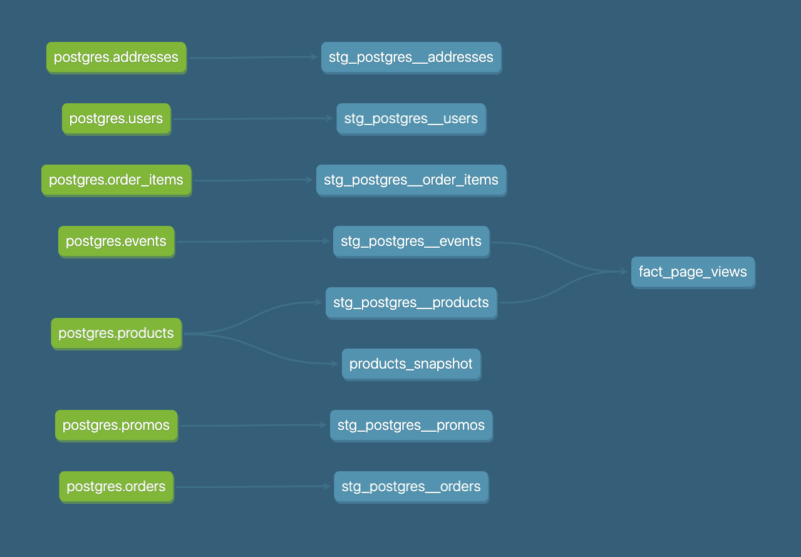

# Week 2

## Part 1. Models

### What is our user repeat rate?
79.84%
```sql
WITH UserPurchaseCounts AS (
    SELECT
        USER_ID,
        COUNT(DISTINCT ORDER_ID) AS PurchaseCount
    FROM
        stg_postgres__orders
    GROUP BY
        USER_ID
),
RepeatUsers AS (
    SELECT
        COUNT(*) AS RepeatUserCount
    FROM
        UserPurchaseCounts
    WHERE
        PurchaseCount >= 2
),
TotalUsers AS (
    SELECT
        COUNT(DISTINCT USER_ID) AS TotalUserCount
    FROM
        stg_postgres__orders
)
SELECT
    (RepeatUserCount::FLOAT / TotalUserCount)*100 AS RepeatRate
FROM
    RepeatUsers, TotalUsers;
```

### What are good indicators of a user who will likely purchase again? What about indicators of users who are likely NOT to purchase again? If you had more data, what features would you want to look into to answer this question?

Likely purchase again:
- Viewed the page at a certain interval in the past week; could be a good indicator that the user will likely purchase again
- If there is a promo running for a product, and the user had bought this product in the past, they might buy it again

Likely NOT to purchase again:
- There are low chances the user would purchase a product if they have spent less time browsing on the product page
- Low page views in general on the app

This might help:
- Product reviews
- Normalized rate of product return by a user over a median

### Explain the product mart models you added. Why did you organize the models in the way you did?

- In `fact_page_views`, I've created a JOIN on events and products, to get the product name for each page_view event.
- This could be used for visualizing page_view's per product, to get a gauge on demand for a particular product in Greenery's inventory.

### Use the dbt docs to visualize your model DAGs to ensure the model layers make sense



## Part 2. Tests 

### What assumptions are you making about each model? (i.e. why are you adding each test?)

For tests, I am adding foundational tests like testing for not_null, uniqueness (especially for id columns), and for non-negative quantities/ prices I am using [DBT Utils package](https://hub.getdbt.com/dbt-labs/dbt_utils/latest/).

### Did you find any “bad” data as you added and ran tests on your models? How did you go about either cleaning the data in the dbt model or adjusting your assumptions/tests?

#### Possible bad data
users.user_id should not be null
```bash
ERROR not_null_stg_postgres__users_user_id ............................ [ERROR in 0.60s]
```

#### Adjusting assumptions
I was asuming that product names in the fact model should not be null as it would be used by BI team
```bash
ERROR not_null_fact_page_views_product_name ............................ [ERROR in 0.73s]
```

`Note: I didnt get a chance to update the models/ tests. So this would be a TODO for upcoming week`

## Part 3. dbt Snapshots

### Which products had their inventory change from week 1 to week 2? 

We check the DBT_VALID_TO col for updates, 

```sql
SELECT PRODUCT_ID, NAME, PRICE,	INVENTORY
FROM DEV_DB.DBT_TDESHPANNMDPORG.PRODUCTS_SNAPSHOT
WHERE DBT_VALID_TO IS NOT NULL;
```

```bash
PRODUCT_ID	                            NAME	            PRICE	INVENTORY
4cda01b9-62e2-46c5-830f-b7f262a58fb1	Pothos	            30.5	40
55c6a062-5f4a-4a8b-a8e5-05ea5e6715a3	Philodendron	    45	    51
be49171b-9f72-4fc9-bf7a-9a52e259836b	Monstera	        50.75	77
fb0e8be7-5ac4-4a76-a1fa-2cc4bf0b2d80	String of pearls	80.5	58
```
