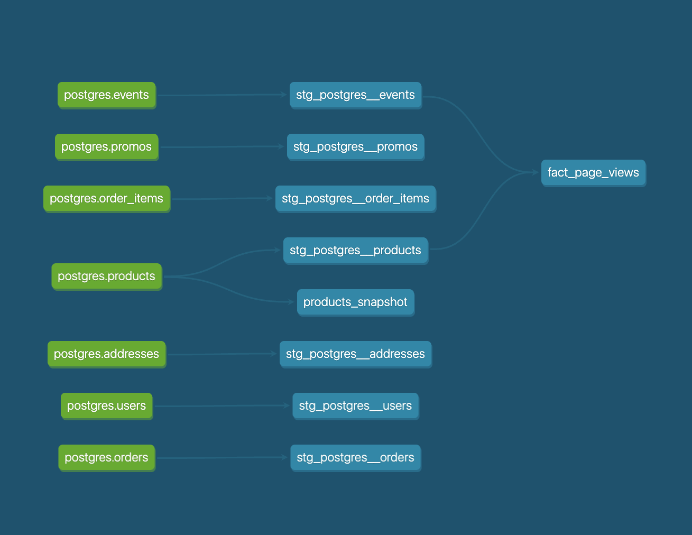

# Week 3

## Part 1. Create new models to answer the first two questions (answer questions in README file)

### What is our overall conversion rate?

```sql
WITH distinct_purchases_per_session AS (
    SELECT DISTINCT(events.session_id) AS session_id
    FROM stg_postgres__events events
    INNER JOIN stg_postgres__orders orders ON events.order_id = orders.order_id
    WHERE events.order_id IS NOT NULL
)
SELECT (
    SELECT COUNT(DISTINCT(session_id)) FROM distinct_purchases_per_session
) / (
    SELECT COUNT(DISTINCT(session_id)) FROM stg_postgres__events
) * 100 AS overall_conversion_rate_percentage;
```
```bash
OVERALL_CONVERSION_RATE_PERCENTAGE
62.4567
```

### What is our conversion rate by product?

```sql
WITH distinct_purchases_per_session_and_product AS (
    SELECT 
        order_items.product_id as product_id, 
        COUNT(DISTINCT(events.session_id)) AS cnt_sessions
    FROM stg_postgres__events events
    INNER JOIN stg_postgres__orders orders ON events.order_id = orders.order_id
    INNER JOIN stg_postgres__order_items order_items ON order_items.order_id = orders.order_id
    WHERE events.order_id IS NOT NULL
    GROUP BY order_items.product_id
),
sessions_per_product AS (
        SELECT events.product_id as product_id, COUNT(DISTINCT(events.session_id)) AS cnt_sessions
    FROM stg_postgres__events events
    WHERE events.product_id IS NOT NULL
    GROUP BY events.product_id
)
SELECT 
    products.name AS product_name,
    ROUND(COALESCE(dppsap.cnt_sessions / sessions_per_product.cnt_sessions, 0)*100, 2) AS conv_rate
FROM
    sessions_per_product
    LEFT JOIN distinct_purchases_per_session_and_product dppsap ON sessions_per_product.product_id = dppsap.product_id
    LEFT JOIN stg_postgres__products products ON sessions_per_product.product_id = products.product_id
```


## Part 2. We’re getting really excited about dbt macros after learning more about them and want to apply them to improve our dbt project. 

### Create a macro to simplify part of a model(s) `DONE`

## Part 3: We’re starting to think about granting permissions to our dbt models in our snowflake database so that other roles can have access to them.

### Add a post hook to your project to apply grants to the role “reporting”. `DONE`

## Part 4:  After learning about dbt packages, we want to try one out and apply some macros or tests. `DONE`

## Part 5: After improving our project with all the things that we have learned about dbt, we want to show off our work!



## Part 6. dbt Snapshots

### Which products had their inventory change from week 2 to week 3? 

We check the DBT_VALID_TO col for updates, 

```sql
SELECT PRODUCT_ID, NAME, PRICE,	INVENTORY
FROM DEV_DB.DBT_TDESHPANNMDPORG.PRODUCTS_SNAPSHOT
WHERE DBT_VALID_TO IS NOT NULL;
```


