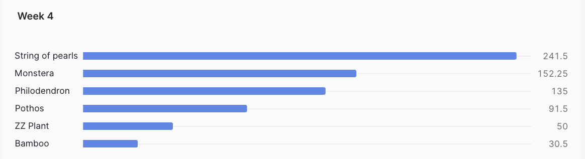
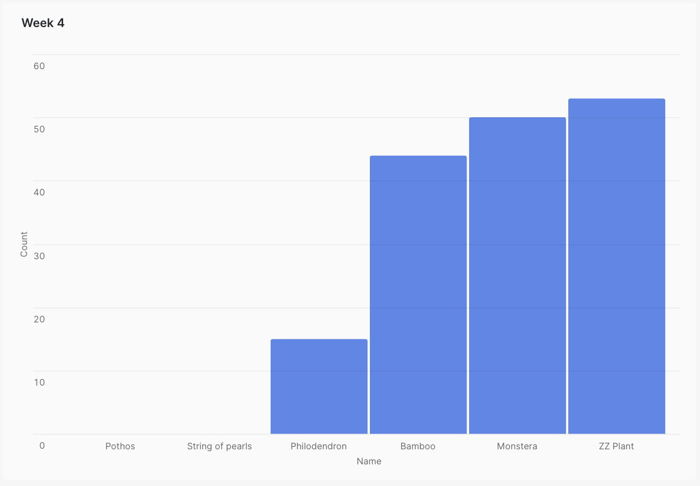

# Week 3

## Part 1. dbt Snapshots

### Run the products snapshot model using dbt snapshot and query it in snowflake to see how the data has changed since last week. 

```sql
SELECT PRODUCT_ID, NAME, PRICE,	INVENTORY
FROM DEV_DB.DBT_TDESHPANNMDPORG.PRODUCTS_SNAPSHOT
WHERE DBT_VALID_TO IS NOT NULL;
```



### Which products had their inventory change from week 3 to week 4? 

```sql
SELECT NAME, INVENTORY, DBT_UPDATED_AT, DBT_VALID_TO
FROM DEV_DB.DBT_TDESHPANNMDPORG.PRODUCTS_SNAPSHOT
WHERE DBT_UPDATED_AT >= '2024-04-01' -- Week 3 begins
AND DBT_VALID_TO >= '2024-04-08' -- Week 4 begins
```



### Now that we have 3 weeks of snapshot data, can you use the inventory changes to determine which products had the most fluctuations in inventory? Did we have any items go out of stock in the last 3 weeks? 

```sql
SELECT PRODUCT_ID, NAME, COUNT(*) as UPDT_COUNT
FROM DEV_DB.DBT_TDESHPANNMDPORG.PRODUCTS_SNAPSHOT
WHERE DBT_VALID_TO IS NOT NULL
GROUP BY PRODUCT_ID, NAME
```

```
PRODUCT_ID	NAME	UPDT_COUNT
b66a7143-c18a-43bb-b5dc-06bb5d1d3160	ZZ Plant	2
689fb64e-a4a2-45c5-b9f2-480c2155624d	Bamboo	2
4cda01b9-62e2-46c5-830f-b7f262a58fb1	Pothos	3
55c6a062-5f4a-4a8b-a8e5-05ea5e6715a3	Philodendron	3
fb0e8be7-5ac4-4a76-a1fa-2cc4bf0b2d80	String of pearls	3
be49171b-9f72-4fc9-bf7a-9a52e259836b	Monstera	3
```

```sql
SELECT NAME, DBT_VALID_TO
FROM DEV_DB.DBT_TDESHPANNMDPORG.PRODUCTS_SNAPSHOT
WHERE INVENTORY = 0
```

```
NAME	DBT_VALID_TO
Pothos	2024-04-13 21:19:28.226
String of pearls	2024-04-13 21:19:28.226
```

## Part 2. Modeling challenge

### How are our users moving through the product funnel?

`page_view` -> `add_to_cart` -> `checkout`

### Which steps in the funnel have largest drop off points?

There is a 22.7% drop off from `add_to_cart` -> `checkout`

```
PAGE_VIEW_COUNT	ADD_TO_CART_COUNT	CHECKOUT_COUNT	DROP_OFF_PRCNTG_PAGE_VIEW_TO_CART	DROP_OFF_PRCNTG_CART_TO_CHECKOUT
578	467	361	19.2	22.7
```

## Part 3: Reflection questions 

### 3A. dbt next steps for you 

#### if your organization is thinking about using dbt, how would you pitch the value of dbt/analytics engineering to a decision maker at your organization?

- data provenance capabilities
- validation thru tests
- dbt docs for reference

### 3B. Setting up for production / scheduled dbt run of your project

- From what I understand, in a pilot program we could use a runner to kick off all the stages in sequence. This would not require any additional infrastucture, but some effort to streamline the stages.
- Might look into on-prem deployment of Dagster, this would take more time and effort to set up. But over time, it would pay off.
